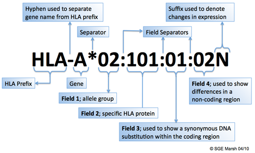
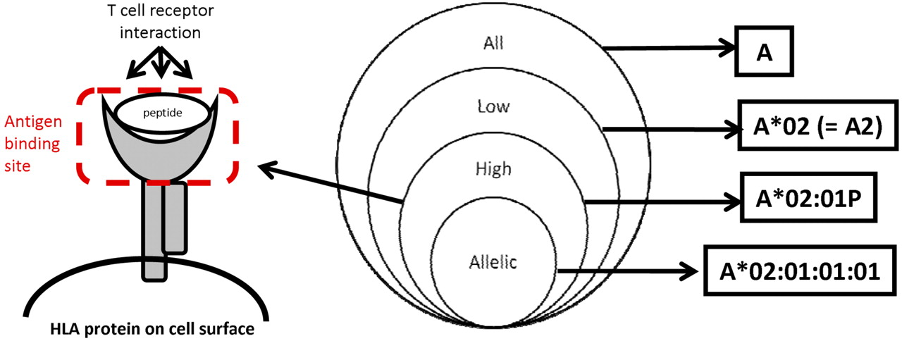

# Pharmacogenetics analysis

## Basic genetic concepts

## Pharmacoscan
Samples were genotyped using a microarray platform (PharmacoScan™) that targets genetic variants reported to be associated with adverse drug reactions. The array contains more than 18,000 variants (single nucleotide polymorphisms (SNPs), insertions and deletions, copy number variants) for genes that have been associated with adverse drug reactions, including DILI, and are involved in the processes of drug absorption, distribution, metabolism, excretion (ADME genes) and antigen presentation (ie, HLA genes). The panel includes 927 HLA-related variants.

File format for genomewide analysis

- `map`, `ped` files

### Single nucleotide variant data

## HLA region targeted sequencing

Labcorp Drug Development performed targeted sequencing of HLA region genes. A next-generation sequencing approach based on the GenDX NGSgo MX11-3 kit™ that provides full coverage of Class I and II HLA genes at high resolution, with the exception of DRB4, was used. For Class I HLA genes A, B, and C, exons 1 through 8 were sequenced. For Class II genes DRB1, DRB3, DRB4, DRB5, DQA1, DQB1, DPA1, and DPB1, exons 1 through 6 were sequenced, with the exception of DRB4, where exons 2 and 3 were sequenced. Exons 2 and 3 code for the peptide binding domain of class I HLA, and exon 3 codes for the peptide domain of class II HLA.

### HLA nomenclature and sequencing output

#### HLA allele naming nomenclature

-  The suffix 'L' is used to indicate an allele which has been shown to have 'Low' cell surface expression when compared to normal levels.
-  The 'S' suffix is used to denote an allele specifying a protein which is expressed as a soluble, 'Secreted' molecule but is not present on the cell surface.
-  The 'C' suffix is assigned to alleles that produce proteins that are present in the 'Cytoplasm' and not on the cell surface.
-  An 'A' suffix indicates an 'Aberrant' expression where there is some doubt as to whether a protein is actually expressed.
-  A 'Q' suffix is used when the expression of an allele is 'Questionable', given that the mutation seen in the allele has been shown to affect normal expression levels in other alleles.
Alleles that have been shown not to be expressed - 'Null' alleles - have been given the suffix 'N'.

#### Sequencing resolution

-  High resolution
	A high-resolution typing result is defined as a set of alleles that encode the same protein sequence for the region of the HLA molecule called the antigen binding site and that exclude alleles that are not expressed as cell-surface proteins. The antigen binding site includes domain 1 and domain 2 of the class I α polypeptides, and domain 1 of the class II α and domain 1 of the class II β polypeptide chains.
-  Low resolution
	A DNA-based typing result at the level of the digits composing the first field in the DNA-based nomenclature. Examples include: A*01; A*02. If the resolution corresponds to a serologic equivalent, this typing result should also be called low resolution.
-  Other levels of resolution
If high resolution cannot be obtained or if the laboratory's agreement with the entity requesting the testing limits the typing efforts to a subset of alleles, the laboratory may report its results at a level of resolution that falls between high resolution and low resolution. Examples are to consider only those alleles expected to be found in the local population or that are designated as common and well defined.3  A third example is typing that assigns a G group designation (eg, A*02:01:01G).