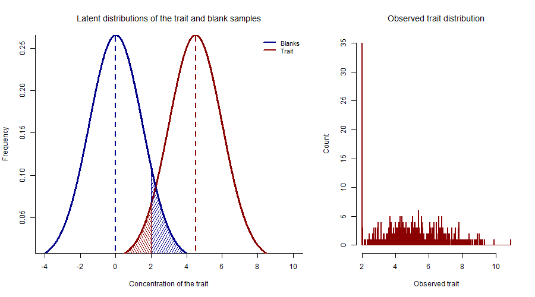
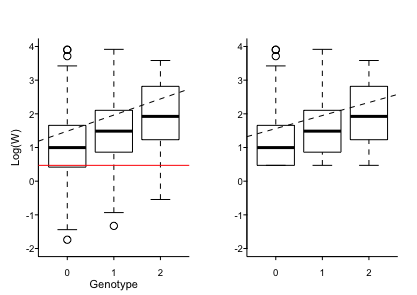
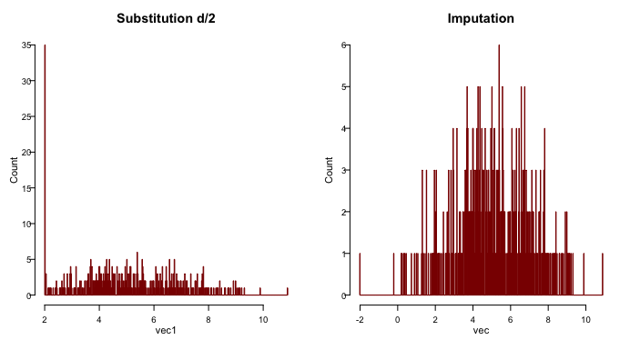
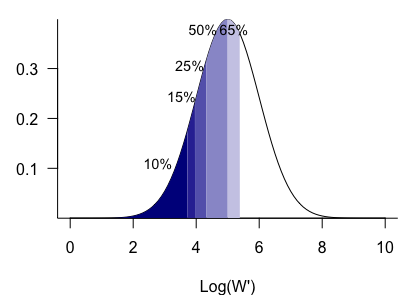

# Detection limit of assays

When measuring the quantitative traits in genetic studies, sometimes analytes at very low level can not be detected by the assay. The values of these samples are often reported as 'non-detects' or at the value of detection limit. 

## Upper and lower detection limit

Detection limit is defined as the concentration of the analyte, which gives a detectable signal above the analytical noise - the signal produced in the absence of the analyte \cite{bernal}. E.g, the minimum detectable concentration for lipoprotein A (LPA) level in the plasma is 2mg/dL using BN ProSpec assay. Samples with LPA level below or equals to 2 mg/dL were reported as 2mg/dL. The over representation of LPA level at 2mg/dL  distorts the normality of the LPA distribution (histogram)     

## Violation in distribution assumption and bias in effect estimate 

Let \emph{Y} represent the latent trait; \emph{Y'} represent the observed trait distribution, at the presence of detection limit, \emph{d}, as in follow:

$$
y'= \left\{\begin{array}{ll}
y & \textrm{if y > $d$ }\\
d & \textrm{if y $\leq$ $d$}\\
\end{array}\right.
$$

$$y= G \beta + u$$

$$
\begin{array}{r}
E(y|G,y>d)= G\beta+ E(u|G,y>d)\\
    = G\beta + E(u|u> d -G\beta)  \\
\end{array}
$$

$$
\begin{array}{l}
y= G \beta + u,u \sim N(0,\sigma ^2)\quad and\quad E(u|G)=0\\ 
E(y|G,y>d)= G\beta+ E(u|G,y>d)\\
    = G\beta + E(u|u> d -G\beta)  \\
    =G\beta+\sigma \frac{\phi(\frac{d-G\beta}{\sigma})}{1-\Phi\frac{d-G\beta}{\sigma}} ^{[2]} \\
\end{array}
$$

\tiny 2. Heckman Annals of Economic and Social Measurement, Volume 5, number 4. NBER; 1976: 475-492.

## Methods for detection limit problem 
Existing methods for handling detection limit for single variable.

### Substitution
Replace censored value with a fixed value such as 

$d, d/2, d/\sqrt{2}, 0$

### KM
Kaplan-Meier (K-M)

### ROS
Regression on ordered statistics (ROS)

### MLE 
Maximum likelihood Estimate  (MLE) 

$$
L(\beta, \sigma) = \prod_{y \leq d}1- \Phi(\frac{d-G\beta}{\sigma})\prod_{y>d}\frac{1}{\sigma}\phi(\frac{y-G\beta}{\sigma})
$$

Where $\phi$ is probability density distribution, $\Phi$ is culmulative density distribution.

$$
\begin{array}{l}
E(y|G)= E(y|G,y>d)Pr(y>d) +E(y|G,y\leq d)Pr(y\leq d)\\
\\
= G\beta+ \sigma \frac{\phi(\frac{d-G\beta}{\sigma})}{1-\Phi(\frac{d-G\beta}{\sigma})}+ d \frac{\phi(\frac{d-G\beta}{\sigma})}{1-\Phi(\frac{d-G\beta}{\sigma})}
\end{array}
$$

## Comparisons of the methods 

